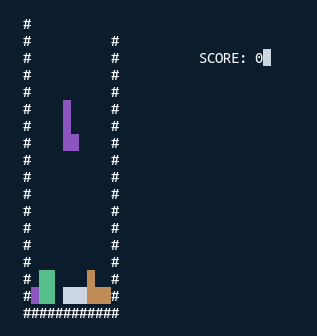

# termtris

First attempts to write some command line Rust. A crude version
of the game of bricks falling into a bucket.

## Build

Build using Cargo:

    $ cargo build --release
    2.9M target/release/termtris

The executable still contains a lot of debug symbols. On Linux,
they can be removed with strip:

    $ strip target/release/termtris
    419K target/release/termtris
